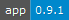

# EzApi

A simple wrapper around jQuery for a json based api system.

[comment_badge_management_start]: <hidden__do_not_remove>
[](https://github.com/voltsonic/jquery-ez-api.git) 

[comment_badge_management_end]: <hidden__do_not_remove>

[Changelog](./CHANGELOG.md) | [Using](./DOCUMENTATION.md)

### Install 

(either or)

To Dependencies
```shell script
npm i --save version-managerment
```

To Development Dependencies:
```shell script
npm i --save-dev version-managerment
```

See [Using](./DOCUMENTATION.md) on how to use.